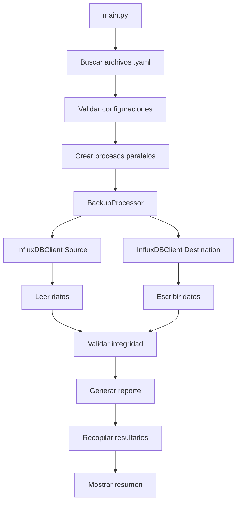

# InfluxDB Backup Toolkit

Sistema completo de backup paralelo para InfluxDB con procesamiento distribuido, validación de integridad y sistema de testing robusto.

## Descripción General

El InfluxDB Backup Toolkit es un sistema de backup distribuido diseñado para transferir datos entre instancias de InfluxDB 1.8 de forma paralela y confiable. El sistema utiliza un enfoque de configuración declarativa donde cada archivo YAML define un proceso de backup independiente que puede ejecutarse en paralelo con otros procesos.

### Características Principales

- **Procesamiento Paralelo**: Ejecuta múltiples procesos de backup simultáneamente
- **Configuración Declarativa**: Archivos YAML para definir procesos de backup
- **Validación de Integridad**: Verificación automática de datos transferidos
- **Sistema de Logging**: Logging estructurado con múltiples niveles
- **Manejo de Errores**: Recuperación automática y manejo de fallos
- **Testing Integral**: Suite completa de tests unitarios e integración
- **Containerización**: Despliegue con Docker y Docker Compose

---

## Arquitectura del Sistema

### Flujo Principal de Datos



### Componentes Principales

#### 1. Orchestrator Principal (`main.py`)
- **Función**: Coordina la ejecución de múltiples procesos de backup
- **Responsabilidades**:
  - Descubrimiento de archivos de configuración
  - Validación de configuraciones
  - Ejecución paralela de procesos
  - Recolección de resultados
  - Manejo de señales del sistema

#### 2. Procesador de Backup (`src/backup_processor.py`)
- **Función**: Ejecuta el proceso de backup individual
- **Responsabilidades**:
  - Lectura de datos desde InfluxDB origen
  - Escritura de datos a InfluxDB destino
  - Validación de integridad
  - Generación de métricas

#### 3. Cliente InfluxDB (`src/influxdb_client.py`)
- **Función**: Abstrae las operaciones con InfluxDB
- **Responsabilidades**:
  - Conexión a servidores InfluxDB
  - Operaciones CRUD (Create, Read, Update, Delete)
  - Manejo de autenticación
  - Gestión de timeouts y reconexiones

#### 4. Gestor de Configuración (`src/config_manager.py`)
- **Función**: Maneja la configuración del sistema
- **Responsabilidades**:
  - Lectura y validación de archivos YAML
  - Validación de esquemas de configuración
  - Manejo de configuraciones por defecto

---

## Estructura Detallada del Proyecto

```
SysAdminToolkit/
├── main.py                     # Orchestrator principal del sistema
├── src/                        # Módulos principales del sistema
│   ├── backup_processor.py     # Procesador de backup individual
│   ├── influxdb_client.py      # Cliente abstracción InfluxDB
│   ├── scheduler.py            # Programador de tareas
│   ├── logger_manager.py       # Gestión centralizada de logs
│   ├── config_manager.py       # Gestión de configuración YAML
│   └── utils.py               # Utilidades comunes
├── config/                     # Configuraciones de procesos de backup
│   ├── backup_config_1.yaml   # Proceso de backup #1
│   ├── backup_config_2.yaml   # Proceso de backup #2
│   └── *.yaml                 # Configuraciones adicionales
├── test/                       # Sistema de testing integral
│   ├── README.md              # Documentación del sistema de testing
│   ├── conftest.py            # Configuración global pytest
│   ├── requirements-test.txt   # Dependencias de testing
│   ├── run_tests.py           # Script ejecutor de tests
│   ├── unit/                  # Tests unitarios
│   │   ├── test_data_generator.py
│   │   ├── test_quality_metrics.py
│   │   └── test_influxdb_client.py
│   ├── integration/           # Tests de integración
│   │   └── test_full_backup_cycle.py
│   ├── data/                  # Generadores de datos de prueba
│   │   ├── data_generator.py
│   │   └── test_datasets.py
│   ├── utils/                 # Utilidades de testing
│   │   ├── quality_metrics.py
│   │   └── influxdb_test_helper.py
│   └── docker/                # Infraestructura Docker testing
│       ├── docker-compose.test.yml
│       └── *.conf
├── volumes/                    # Volúmenes persistentes Docker
│   ├── backup_logs/           # Logs del sistema
│   ├── influxdb_data/         # Datos InfluxDB
│   ├── loki/                  # Logs centralizados
│   └── grafana/               # Dashboards y configuración
├── docker-compose.yaml         # Servicios principales
├── backup_config.yaml.template # Template de configuración
└── README.md                  # Este archivo
```

### Descripción de Directorios

#### `/src` - Módulos Principales
- **backup_processor.py**: Lógica central del proceso de backup
- **influxdb_client.py**: Cliente robusto para InfluxDB con manejo de errores
- **scheduler.py**: Programador de tareas con soporte para cron
- **logger_manager.py**: Sistema de logging estructurado
- **config_manager.py**: Validación y gestión de configuraciones YAML
- **utils.py**: Funciones auxiliares y utilidades comunes

#### `/config` - Configuraciones de Backup
Contiene archivos YAML que definen procesos de backup independientes. Cada archivo representa:
- Servidor InfluxDB origen
- Servidor InfluxDB destino
- Bases de datos a transferir
- Configuraciones de backup (modo, tamaño de página, timeouts)

#### `/test` - Sistema de Testing
Sistema completo de testing con:
- **Tests unitarios**: Verificación de componentes individuales
- **Tests de integración**: Verificación de flujos completos
- **Generadores de datos**: Creación de datasets de prueba
- **Métricas de calidad**: Validación de integridad de datos

#### `/volumes` - Persistencia Docker
Volúmenes Docker para:
- **backup_logs**: Logs del sistema de backup
- **influxdb_data**: Datos persistentes de InfluxDB
- **loki**: Logs centralizados
- **grafana**: Dashboards y configuración

---

## Configuración del Sistema

### Archivo de Configuración de Backup

Cada proceso de backup se define en un archivo YAML con la siguiente estructura:

```yaml
# Configuración del proceso de backup
backup_process_name:
  # Servidor InfluxDB origen
  source_server:
    url: "http://localhost:8086"
    user: "admin"
    password: "password"
    database: "metrics"

  # Servidor InfluxDB destino
  destination_server:
    url: "http://localhost:8087"
    user: "admin"
    password: "password"
    database: "metrics_backup"

  # Configuración del backup
  backup_config:
    mode: "incremental"          # full | incremental
    page_size: 10000            # Registros por página
    timeout: 300                # Timeout en segundos
    validate_data: true         # Validar integridad

  # Configuración de logging
  logging:
    level: "INFO"               # DEBUG | INFO | WARNING | ERROR
    file: "/logs/backup.log"    # Archivo de log
```

### Variables de Entorno

```bash
# Configuración Grafana
GF_SECURITY_ADMIN_USER=admin
GF_SECURITY_ADMIN_PASSWORD=password

# Configuración InfluxDB
INFLUXDB_NETWORK=influxdb_network
INFLUXDB_DATA_PATH=/var/lib/influxdb
```

---

## Instalación y Despliegue

### Prerrequisitos

- Docker 20.10+
- Docker Compose 1.29+
- Python 3.8+ (para desarrollo local)
- Git

### Instalación con Docker

#### 1. Clonar el Repositorio

```bash
git clone <repository-url>
cd SysAdminToolkit
```

#### 2. Crear Estructura de Directorios

```bash
mkdir -p volumes/backup_logs
mkdir -p volumes/influxdb_data
mkdir -p volumes/loki
mkdir -p volumes/grafana/data
```

#### 3. Configurar Variables de Entorno

```bash
# Crear archivo .env
cat > .env << EOF
GF_SECURITY_ADMIN_USER=admin
GF_SECURITY_ADMIN_PASSWORD=tu_password_seguro
INFLUXDB_NETWORK=influxdb_network
EOF
```

#### 4. Configurar Procesos de Backup

```bash
# Copiar template de configuración
cp backup_config.yaml.template backup_config.yaml

# Editar configuración según necesidades
nano backup_config.yaml
```

#### 5. Levantar Servicios

```bash
# Desarrollo
docker-compose --profile development up -d

# Producción
docker-compose --profile production up -d
```

### Verificación de Instalación

```bash
# Verificar servicios activos
docker-compose ps

# Verificar logs
docker-compose logs -f sysadmintoolkit-backup-service-dev

# Verificar conectividad InfluxDB
curl http://localhost:8086/ping

# Verificar Grafana
curl http://localhost:3000
```

---

## Uso del Sistema

### Ejecución Manual

```bash
# Desde contenedor Docker
docker-compose exec sysadmintoolkit-backup-service-dev python main.py

# Desde host (con Python instalado)
python main.py

# Con parámetros específicos
python main.py --config /path/to/config --verbose

# Solo validar configuraciones
python main.py --validate-only
```

### Opciones de Línea de Comandos

```bash
# Ayuda
python main.py --help

# Directorio de configuración personalizado
python main.py --config /custom/config/path

# Logging verbose
python main.py --verbose

# Solo validar configuraciones
python main.py --validate-only
```

### Monitoreo y Observabilidad

#### Servicios Disponibles

- **InfluxDB**: `http://localhost:8086` (base de datos principal)
- **Grafana**: `http://localhost:3000` (dashboards - admin/admin)
- **Loki**: `http://localhost:3100` (logs centralizados)

#### Logs del Sistema

```bash
# Logs en tiempo real
docker-compose logs -f sysadmintoolkit-backup-service-dev

# Logs de archivo
tail -f volumes/backup_logs/backup.log

# Logs específicos de un proceso
grep "backup_process_1" volumes/backup_logs/backup.log
```

---

## Sistema de Testing

Para información detallada sobre el sistema de testing, consulte [`test/README.md`](test/README.md).

### Ejecución Rápida de Tests

```bash
# Instalar dependencias de testing
pip install -r test/requirements-test.txt

# Levantar servicios de testing
cd test/docker
docker-compose -f docker-compose.test.yml up -d

# Ejecutar todos los tests
cd ../..
python test/run_tests.py

# Solo tests unitarios
python test/run_tests.py --unit-only
```

---

## Solución de Problemas

### Problemas Comunes

#### Servicios no Inician

```bash
# Verificar logs
docker-compose logs

# Verificar puertos ocupados
netstat -tlnp | grep :8086

# Reconstruir imágenes
docker-compose build --no-cache
```

#### Errores de Conexión InfluxDB

```bash
# Verificar conectividad
curl http://localhost:8086/ping

# Verificar credenciales
curl -u admin:password http://localhost:8086/query?q=SHOW+DATABASES
```

#### Problemas de Permisos

```bash
# Ajustar permisos de volúmenes
sudo chown -R $USER:$USER volumes/

# Verificar permisos Docker
sudo usermod -aG docker $USER
```

#### Limpiar Instalación

```bash
# Parar todos los servicios
docker-compose down

# Eliminar volúmenes (CUIDADO: elimina todos los datos)
docker-compose down -v

# Limpiar sistema Docker
docker system prune -a

# Reinstalar desde cero
docker-compose --profile development up -d
```

---

## Desarrollo y Contribución

### Configuración del Entorno de Desarrollo

```bash
# Instalar dependencias de desarrollo
pip install -r requirements-dev.txt

# Instalar hooks pre-commit
pre-commit install

# Ejecutar linting
flake8 src/
black src/
isort src/
```

### Estructura de Contribución

1. Fork del repositorio
2. Crear rama de feature (`git checkout -b feature/nombre-feature`)
3. Realizar cambios con tests
4. Ejecutar suite de tests (`python test/run_tests.py`)
5. Commit con mensajes descriptivos
6. Push a la rama (`git push origin feature/nombre-feature`)
7. Crear Pull Request

### Estándares de Código

- **PEP 8**: Estilo de código Python
- **Type Hints**: Uso obligatorio de type hints
- **Docstrings**: Documentación de funciones y clases
- **Tests**: Cobertura mínima del 80%
- **Logging**: Logging estructurado con niveles apropiados

---

## Recursos Adicionales

### Documentación de Referencia

- [Documentación InfluxDB 1.8](https://docs.influxdata.com/influxdb/v1.8/)
- [Documentación Grafana](https://grafana.com/docs/)
- [Documentación Loki](https://grafana.com/docs/loki/)
- [Docker Compose Reference](https://docs.docker.com/compose/)

### Monitoreo y Alertas

- **Métricas de Sistema**: CPU, memoria, disco
- **Métricas de Backup**: Tiempo de ejecución, registros transferidos
- **Alertas**: Fallos de backup, timeouts, errores de conexión

### Seguridad

- **Autenticación**: Credenciales InfluxDB
- **Logs**: No exposición de credenciales en logs
- **Red**: Comunicación segura entre servicios
- **Volúmenes**: Permisos apropiados en volúmenes Docker

---

## Licencia

Este proyecto está licenciado bajo la Licencia MIT. Consulte el archivo [LICENSE](LICENSE) para más detalles.
