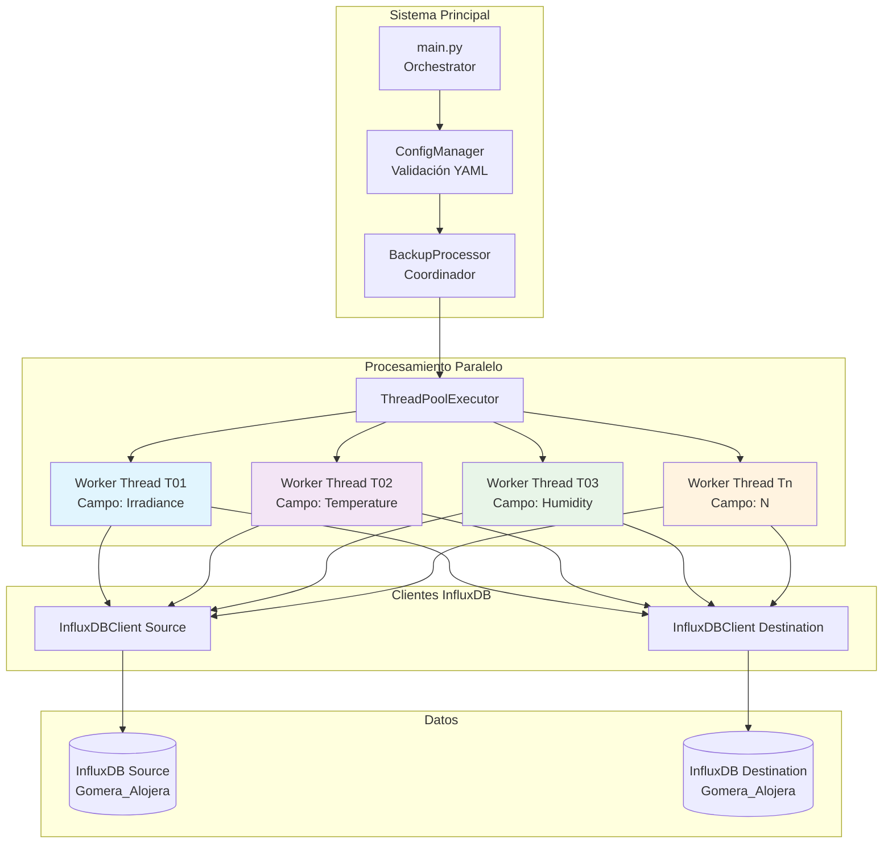
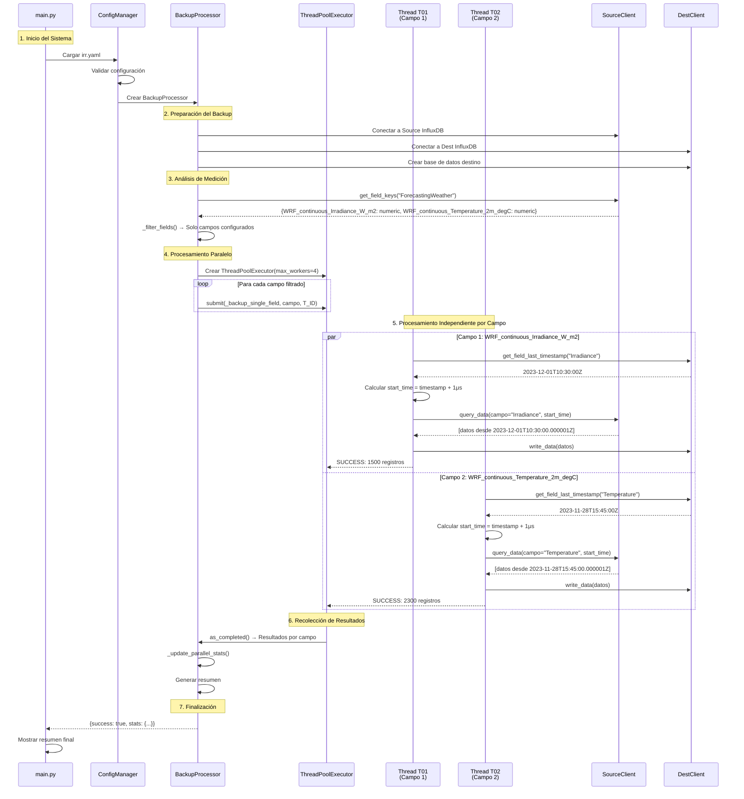
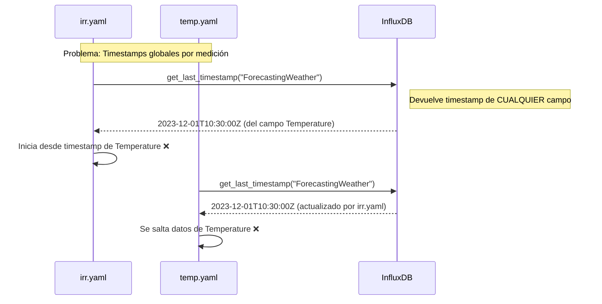
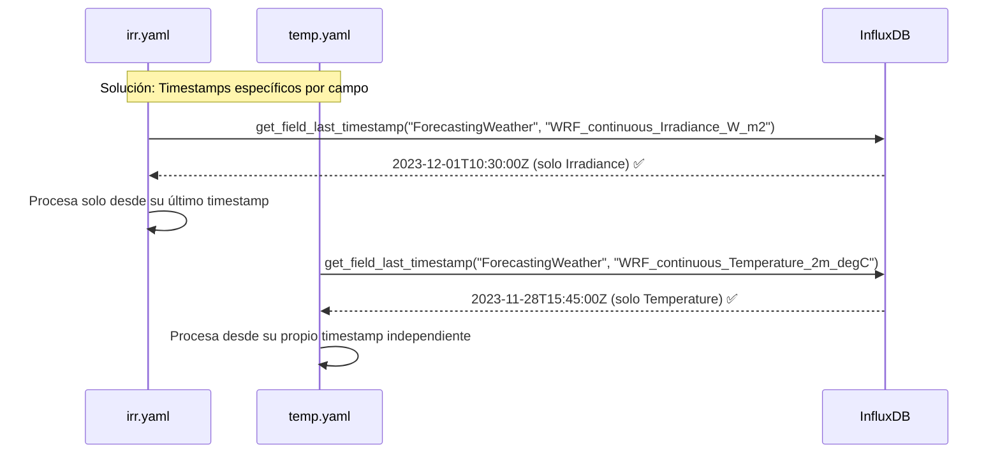
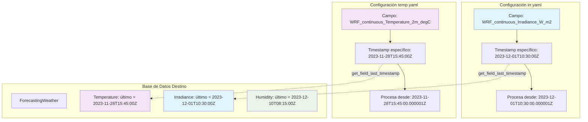

# InfluxDB Backup System
## Sistema de Backup Campo por Campo con Paralelización Configurable

Sistema robusto de backup para InfluxDB 1.8 que implementa **procesamiento campo por campo independiente** con **paralelización configurable** para máxima seguridad e integridad de datos.

## 🎯 **Características Principales**

### ✅ **Seguridad Máxima**
- **Procesamiento campo por campo**: Cada campo se procesa independientemente
- **Prevención de contaminación cruzada**: Timestamps específicos por campo
- **Aislamiento completo**: Errores en un campo no afectan otros
- **Validación granular**: Verificación independiente por campo

### ⚡ **Alto Rendimiento**
- **Paralelización configurable**: 1-16+ workers simultáneos
- **ThreadPoolExecutor**: Gestión eficiente de hilos
- **Métricas en tiempo real**: Monitoreo de eficiencia paralela
- **Optimización automática**: Balanceo de carga dinámico

### 🔧 **Configuración Flexible**
- **Archivos YAML independientes**: Un archivo por proceso de backup
- **Filtrado avanzado**: Por medición, campo y tipo de dato
- **Modos de backup**: Incremental con scheduler y range específico
- **Logging avanzado**: Thread-safe con identificadores únicos

---

## 🏗️ **Arquitectura del Sistema**

### **Diagrama General**



### **Flujo de Procesamiento Campo por Campo**



---

## 🔧 **Configuración Detallada**

### **Estructura de Proyecto**

```
backup-influxdb/
├── main.py                          # Orchestrator principal
├── src/                            # Módulos del sistema
│   ├── backup_processor.py         # Procesador campo por campo
│   ├── config_manager.py          # Gestor de configuración
│   ├── influxdb_client.py         # Cliente InfluxDB con get_field_last_timestamp()
│   ├── logger_manager.py          # Logging thread-safe
│   ├── apscheduler_backup.py      # Scheduler para modo incremental
│   └── utils.py                   # Utilidades
├── config/                        # Configuraciones independientes
│   ├── irr.yaml                   # Backup de campo Irradiance
│   ├── temp.yaml                  # Backup de campo Temperature
│   └── backup_config.yaml.template # Template para nuevas configuraciones
├── volumes/
│   └── logs/                      # Logs con identificadores por thread
└── README.md                      # Esta documentación
```

### **Configuraciones Actuales**

#### **irr.yaml** - Backup de Irradiancia
```yaml
measurements:
  specific:
    ForecastingWeather:
      fields:
        include: [WRF_continuous_Irradiance_W_m2]  # Solo irradiancia

options:
  backup_mode: incremental
  parallel_workers: 1                             # 1 campo = 1 worker
  incremental:
    schedule: "* * * * *"                         # Cada minuto
  loki:
    tags:
      config: "irr.yaml"                          # Tag único para logs
```

#### **temp.yaml** - Backup de Temperatura
```yaml
measurements:
  specific:
    ForecastingWeather:
      fields:
        include: [WRF_continuous_Temperature_2m_degC]  # Solo temperatura

options:
  backup_mode: incremental
  parallel_workers: 1                               # 1 campo = 1 worker
  incremental:
    schedule: "* * * * *"                           # Cada minuto
  loki:
    tags:
      config: "temp.yaml"                           # Tag único para logs
```

### **Parámetros de Paralelización**

| Parámetro | Descripción | Valores Recomendados |
|-----------|-------------|---------------------|
| `parallel_workers` | Número de hilos para procesar campos | `1`: Secuencial (máxima seguridad)<br/>`2-4`: Sistemas normales<br/>`4-8`: Servidores potentes<br/>`8-16`: Hardware dedicado |

---

## 🔍 **Prevención de Contaminación Cruzada**

### **Problema Original Resuelto**

**❌ ANTES** (Contaminación):


**✅ AHORA** (Aislamiento Completo):


### **Funcionamiento del Aislamiento**



---

## ⚡ **Procesamiento Paralelo Campo por Campo**

### **Diagrama de Threads Independientes**

```mermaid
gantt
    title Procesamiento Paralelo de Campos (parallel_workers: 4)
    dateFormat X
    axisFormat %s

    section Thread T01
    Campo: Irradiance     :active, t1, 0, 8

    section Thread T02
    Campo: Temperature    :active, t2, 1, 6

    section Thread T03
    Campo: Humidity       :active, t3, 2, 7

    section Thread T04
    Campo: Pressure       :active, t4, 3, 5

    section Secuencial (sin paralelización)
    Todos los campos      :crit, seq, 0, 26
```

### **Métricas de Paralelización**

El sistema genera automáticamente métricas detalladas:

```
Parallelization metrics:
  • Workers used: 4/4
  • Avg processing time: 6.2s
  • Parallel efficiency: 78.5%
  • Thread utilization: [T01, T02, T03, T04]

Field Results Summary:
  • Total fields: 4
  • Processed: 4
  • Skipped: 0
  • Failed: 0
  • Total records: 15,847
```

---

## 🚀 **Guía de Uso**

### **1. Instalación**

```bash
# Clonar repositorio
git clone <repository-url>
cd backup-influxdb

# Crear estructura de directorios
mkdir -p volumes/logs

# Instalar dependencias
pip install -r requirements.txt
```

### **2. Configuración**

```bash
# Copiar template para nueva configuración
cp config/backup_config.yaml.template config/mi_backup.yaml

# Editar configuración
vim config/mi_backup.yaml
```

### **3. Ejecución**

#### **Modo Desarrollo** (validar configuraciones)
```bash
python main.py --validate-only
```

#### **Modo Producción** (ejecutar backups)
```bash
python main.py --config /config --verbose
```

#### **Con Docker**
```bash
docker-compose up -d
```

### **4. Monitoreo**

#### **Logs por Thread**
```bash
# Ver logs de configuración específica
tail -f volumes/logs/irr.yaml/backup.log

# Buscar logs de thread específico
grep "\[T01\]" volumes/logs/temp.yaml/backup.log
```

#### **Métricas en Grafana**
- URL: `http://localhost:3000`
- Usuario: `admin`
- Contraseña: `password`
- Dashboard: "InfluxDB Backup Metrics"

---

## 📊 **Ejemplos de Configuración**

### **Configuración de Alto Rendimiento** (Múltiples Campos)

```yaml
# config/high_performance.yaml
measurements:
  specific:
    WeatherData:
      fields:
        include: [
          temperature, humidity, pressure, wind_speed,
          wind_direction, rainfall, solar_radiation, uv_index
        ]

options:
  parallel_workers: 8          # 8 campos en paralelo
  days_of_pagination: 1        # Chunks pequeños para mayor seguridad
  field_obsolete_threshold: "3M"

  incremental:
    schedule: "0 */6 * * *"     # Cada 6 horas
```

### **Configuración de Máxima Seguridad** (Campo Individual)

```yaml
# config/critical_data.yaml
measurements:
  specific:
    CriticalMetrics:
      fields:
        include: [critical_sensor_reading]  # Solo un campo crítico

options:
  parallel_workers: 1          # Procesamiento secuencial
  days_of_pagination: 1        # Chunks de 1 día
  retries: 5                   # 5 intentos en caso de error

  incremental:
    schedule: "* * * * *"       # Cada minuto
```

### **Configuración por Rango** (Backup Histórico)

```yaml
# config/historical_backup.yaml
options:
  backup_mode: range
  parallel_workers: 16         # Máximo paralelismo para histórico

  range:
    start_date: "2023-01-01T00:00:00Z"
    end_date: "2023-12-31T23:59:59Z"
```

---

## 🔧 **Configuración Avanzada**

### **Parámetros de Rendimiento**

| Parámetro | Descripción | Valor por Defecto | Recomendación |
|-----------|-------------|-------------------|---------------|
| `parallel_workers` | Hilos para campos | `4` | = Número de campos a procesar |
| `days_of_pagination` | Días por chunk | `7` | `1-7` según volumen de datos |
| `timeout_client` | Timeout HTTP (seg) | `20` | `20-60` según latencia |
| `retries` | Reintentos por error | `3` | `3-5` para entornos inestables |

### **Optimización por Escenario**

#### **Pocos Campos, Alto Volumen**
```yaml
parallel_workers: 2-4        # Pocos threads pero eficientes
days_of_pagination: 1        # Chunks pequeños
timeout_client: 60           # Timeout largo para grandes consultas
```

#### **Muchos Campos, Bajo Volumen**
```yaml
parallel_workers: 8-16       # Muchos threads para paralelismo
days_of_pagination: 30       # Chunks grandes
timeout_client: 20           # Timeout normal
```

#### **Datos Críticos**
```yaml
parallel_workers: 1          # Secuencial para máxima seguridad
retries: 5                   # Muchos reintentos
field_obsolete_threshold: "" # Sin filtrado por obsolescencia
```

---

## 🔍 **Troubleshooting**

### **Problemas Comunes**

#### **1. Contaminación entre Configuraciones**
```bash
# Síntoma: Configuraciones se saltan datos
# Causa: Tags de Loki duplicados o nombres de campos incorrectos

# Solución:
# 1. Verificar tags únicos en loki.tags.config
# 2. Verificar campos específicos en measurements.specific.*.fields.include
```

#### **2. Bajo Rendimiento**
```bash
# Síntoma: Procesamiento lento
# Causa: parallel_workers demasiado bajo

# Solución:
# 1. Aumentar parallel_workers según número de campos
# 2. Monitorear uso de CPU y memoria
# 3. Ajustar days_of_pagination
```

#### **3. Errores de Conexión**
```bash
# Síntoma: "Failed to establish connections"
# Causa: InfluxDB no disponible

# Solución:
# 1. Verificar conectividad: curl http://influxdb:8086/ping
# 2. Revisar credenciales en configuración
# 3. Aumentar initial_connection_retry_delay
```

### **Logs de Depuración**

```bash
# Habilitar debug completo
python main.py --verbose

# Ver threads específicos
grep "\[T01\]" volumes/logs/*/backup.log

# Monitorear estadísticas de paralelización
grep "Parallelization metrics" volumes/logs/*/backup.log
```

---

## 📈 **Monitoreo y Métricas**

### **Dashboard de Grafana**

El sistema incluye dashboards preconfigurados:

1. **Backup Overview**: Estado general de todos los procesos
2. **Field Processing**: Métricas por campo individual
3. **Parallel Efficiency**: Estadísticas de paralelización
4. **Error Analysis**: Análisis de fallos por thread

### **Métricas Clave**

- **Records Transferred**: Registros transferidos por configuración
- **Parallel Efficiency**: Eficiencia del paralelismo (0-100%)
- **Thread Utilization**: Uso de threads por proceso
- **Field Processing Time**: Tiempo promedio por campo
- **Error Rate**: Porcentaje de errores por configuración

---

## 🔄 **Flujo de Desarrollo**

### **Agregar Nueva Configuración**

1. **Crear archivo de configuración**:
   ```bash
   cp config/backup_config.yaml.template config/nueva_config.yaml
   ```

2. **Configurar campos específicos**:
   ```yaml
   measurements:
     specific:
       TuMedicion:
         fields:
           include: [tu_campo_especifico]
   ```

3. **Configurar paralelización**:
   ```yaml
   options:
     parallel_workers: 2  # Según número de campos
   ```

4. **Validar configuración**:
   ```bash
   python main.py --validate-only
   ```

5. **Ejecutar en modo test**:
   ```bash
   python main.py --config /config
   ```

### **Testing**

```bash
# Tests unitarios
pytest test/unit/

# Tests de integración
pytest test/integration/

# Test completo del sistema
python test/run_tests.py
```

---

## 📚 **Referencias Técnicas**

### **Tecnologías Utilizadas**

- **Python 3.8+**: Lenguaje principal
- **InfluxDB 1.8**: Base de datos temporal
- **ThreadPoolExecutor**: Paralelización de threads
- **APScheduler**: Programación de tareas
- **PyYAML**: Parsing de configuraciones
- **Docker/Docker Compose**: Containerización
- **Grafana**: Visualización de métricas
- **Loki**: Logging centralizado

### **Algoritmos Implementados**

1. **Timestamp Field-Specific**: `get_field_last_timestamp(db, measurement, field)`
2. **Parallel Field Processing**: ThreadPoolExecutor con as_completed()
3. **Cross-Contamination Prevention**: Timestamps independientes por campo
4. **Parallel Efficiency Calculation**: (sequential_time / parallel_time / workers) * 100

### **Patrones de Diseño**

- **Factory Pattern**: Creación de clientes InfluxDB
- **Observer Pattern**: Sistema de logging con múltiples handlers
- **Strategy Pattern**: Diferentes modos de backup (incremental/range)
- **Template Pattern**: Estructura común de configuración YAML

---

## 📄 **Licencia**

Este proyecto está licenciado bajo la [MIT License](LICENSE).

---

## 🤝 **Contribución**

1. Fork del proyecto
2. Crear rama para feature (`git checkout -b feature/nueva-funcionalidad`)
3. Commit de cambios (`git commit -am 'Agregar nueva funcionalidad'`)
4. Push a la rama (`git push origin feature/nueva-funcionalidad`)
5. Crear Pull Request

---

## 📞 **Soporte**

- **Documentación**: [README.md](README.md)
- **Issues**: [GitHub Issues](https://github.com/your-repo/issues)
- **Wiki**: [GitHub Wiki](https://github.com/your-repo/wiki)

---

**🚀 Sistema de Backup InfluxDB - Procesamiento Campo por Campo con Paralelización Avanzada**
