# Sistema de Backup InfluxDB - Procesamiento Campo por Campo con Paralelización Avanzada

**Solución empresarial de backup para InfluxDB con procesamiento paralelo optimizado y aislamiento completo de datos**

## **Características Principales**

### **Seguridad Máxima**
- **Aislamiento completo**: Cada campo se procesa de forma independiente
- **Prevención de contaminación cruzada**: Los timestamps de diferentes campos nunca se mezclan
- **Transacciones atómicas**: Garantiza integridad de datos en caso de fallo
- **Rollback automático**: Recuperación completa ante errores críticos

### **Alto Rendimiento**
- **Procesamiento paralelo**: Múltiples campos procesados simultáneamente
- **Optimización de memoria**: Gestión inteligente de buffers por worker
- **Batch processing**: Agrupación eficiente de inserts para máximo throughput
- **Pool de conexiones**: Reutilización optimizada de conexiones InfluxDB
- **Monitoreo en tiempo real**: Métricas detalladas de rendimiento

### **Configuración Flexible**
- **YAML declarativo**: Configuración clara y mantenible
- **Múltiples bases de datos**: Soporte simultáneo para varios orígenes
- **Filtrado avanzado**: Por rangos de tiempo, campos específicos o mediciones
- **Programación automática**: Integración con APScheduler para ejecuciones periódicas
- **Logging granular**: Trazabilidad completa de operaciones

## **Arquitectura del Sistema**


---

## **Configuración Detallada**

### Estructura del Archivo YAML

```yaml
# Configuración principal del sistema
version: "1.0"
app_name: "InfluxDB Field Backup System"

# Configuración de logging
logging:
  level: "INFO"
  format: "%(asctime)s - %(name)s - %(levelname)s - %(message)s"
  handlers:
    console:
      enabled: true
      level: "INFO"
    file:
      enabled: true
      level: "DEBUG"
      filename: "logs/backup_{timestamp}.log"
      max_bytes: 10485760  # 10MB
      backup_count: 5

# Configuraciones de base de datos
databases:
  source:
    host: "localhost"
    port: 8086
    username: "admin"
    password: "password"
    database: "iot_sensors"
    ssl: false
    verify_ssl: false
    timeout: 30
    retries: 3

  backup:
    host: "localhost"
    port: 8087
    username: "backup_user"
    password: "backup_pass"
    database: "iot_sensors_backup"
    ssl: false
    verify_ssl: false
    timeout: 30
    retries: 3

# Configuración de procesamiento
processing:
  # Número de workers paralelos (uno por campo)
  max_workers: 4

  # Tamaño de lote para inserts
  batch_size: 1000

  # Intervalo entre lotes (segundos)
  batch_interval: 0.1

  # Buffer de memoria por worker (MB)
  worker_memory_limit: 256

  # Timeout por operación (segundos)
  operation_timeout: 300

# Configuración de backup específica
backup:
  # Mediciones a procesar
  measurements:
    - name: "temperature_data"
      fields: ["value", "quality"]
      start_time: "2023-01-01T00:00:00Z"
      end_time: "2023-12-31T23:59:59Z"

    - name: "pressure_data"
      fields: ["value", "status"]
      start_time: "2023-06-01T00:00:00Z"
      # end_time no especificado = hasta ahora

  # Configuración de chunks temporales
  time_chunks:
    size: "1h"      # Tamaño de chunk: 1h, 1d, 1w
    overlap: "1m"   # Solapamiento entre chunks

  # Configuración de reintentos
  retry:
    max_attempts: 3
    backoff_factor: 2
    max_backoff: 60

# Configuración de programación automática
scheduler:
  enabled: true
  timezone: "UTC"

  jobs:
    - id: "daily_backup"
      trigger: "cron"
      hour: 2
      minute: 0
      enabled: true

    - id: "weekly_full_backup"
      trigger: "cron"
      day_of_week: "sun"
      hour: 1
      minute: 0
      enabled: false

# Configuración de monitoreo
monitoring:
  metrics:
    enabled: true
    interval: 30  # segundos

  alerts:
    enabled: true
    thresholds:
      error_rate: 0.05    # 5% de errores
      memory_usage: 0.80  # 80% de memoria
      duration: 3600      # 1 hora máximo
```

---

## **Prevención de Contaminación Cruzada**

### Problema Original

**ANTES** (Contaminación):

```mermaid
sequenceDiagram
    participant B as BackupProcessor
    participant I as InfluxDB Source
    participant T as Target DB

    Note over B: ❌ Problema: Shared State
    B->>I: "SELECT last_timestamp FROM all_fields"
    I->>B: "2023-12-01T10:30:00Z (Irradiance)"

    Note over B: Usa timestamp de Irradiance para Temperature
    B->>I: "SELECT * FROM Temperature WHERE time > 2023-12-01T10:30:00Z"
    I->>I: Inicia desde timestamp de Temperature INCORRECTO
    I->>B: Datos desde 10:30 (se salta datos anteriores)
    B->>T: Inserta datos incompletos
    T->>T: Se salta datos de Temperature CRÍTICOS
```


**AHORA** (Aislamiento Completo):
```mermaid
sequenceDiagram
    participant BP as BackupProcessor
    participant W1 as Worker Irradiance
    participant W2 as Worker Temperature
    participant I as InfluxDB Source
    participant T as Target DB

    Note over BP: Campo por campo, aislado
    BP->>W1: Procesar Irradiance
    BP->>W2: Procesar Temperature

    W1->>I: "SELECT last_timestamp FROM Irradiance"
    I-->>W1: 2023-12-01T10:30:00Z (solo Irradiance) CORRECTO

    W2->>I: "SELECT last_timestamp FROM Temperature"
    I-->>W2: 2023-11-28T15:45:00Z (solo Temperature) CORRECTO

    parallel
        W1->>T: Procesa Irradiance desde 10:30
    and
        W2->>T: Procesa Temperature desde 15:45
    end
```

### Implementación del Aislamiento

```python
class FieldWorker:
    def __init__(self, measurement: str, field: str):
        self.measurement = measurement
        self.field = field
        self.last_timestamp = None  # Estado aislado por campo

    def get_last_timestamp(self) -> Optional[datetime]:
        """Obtiene el último timestamp específico para este campo"""
        query = f"""
        SELECT last({self.field}), time
        FROM {self.measurement}
        WHERE {self.field} IS NOT NULL
        """
        # Solo para este campo específico
        return self.client.query(query)

    def process_field_data(self):
        """Procesa solo datos de este campo específico"""
        start_time = self.get_last_timestamp() or self.config_start_time

        query = f"""
        SELECT time, {self.field}
        FROM {self.measurement}
        WHERE time > '{start_time}'
        AND {self.field} IS NOT NULL
        ORDER BY time ASC
        """

        # Procesamiento aislado
        for batch in self.client.query_chunked(query):
            self.process_batch(batch)
```

---

## **Procesamiento Paralelo Campo por Campo**

### Arquitectura de Workers


---

## **Guía de Uso**

### Instalación

```bash
# Clonar el repositorio
git clone https://github.com/usuario/backup-influxdb.git
cd backup-influxdb

# Crear entorno virtual
python -m venv venv
source venv/bin/activate  # En Windows: venv\Scripts\activate

# Instalar dependencias
pip install -r requirements.txt

# Configurar archivo de configuración
cp config/backup_config.yaml.template config/backup_config.yaml
# Editar config/backup_config.yaml con tus configuraciones
```

### Configuración Básica

1. **Configurar conexiones de base de datos**:
```yaml
databases:
  source:
    host: "tu-influxdb-source.com"
    port: 8086
    username: "tu_usuario"
    password: "tu_password"
    database: "tu_database"

  backup:
    host: "tu-influxdb-backup.com"
    port: 8086
    username: "backup_usuario"
    password: "backup_password"
    database: "backup_database"
```

2. **Definir mediciones y campos**:
```yaml
backup:
  measurements:
    - name: "sensor_data"
      fields: ["temperature", "humidity", "pressure"]
      start_time: "2023-01-01T00:00:00Z"
```

### Ejecución

```bash
# Ejecución simple
python main.py --config config/backup_config.yaml

# Con logging detallado
python main.py --config config/backup_config.yaml --log-level DEBUG

# Backup específico por medición
python main.py --config config/backup_config.yaml --measurement sensor_data

# Backup por rango de fechas
python main.py --config config/backup_config.yaml \
  --start-time "2023-01-01T00:00:00Z" \
  --end-time "2023-01-31T23:59:59Z"
```

---

## **Ejemplos de Configuración**

### Configuración Básica para IoT

```yaml
version: "1.0"
app_name: "IoT Sensors Backup"

databases:
  source:
    host: "iot-influxdb.local"
    port: 8086
    database: "iot_sensors"

  backup:
    host: "backup-influxdb.local"
    port: 8086
    database: "iot_sensors_backup"

backup:
  measurements:
    - name: "temperature_sensors"
      fields: ["value", "quality_flag"]
      start_time: "2023-01-01T00:00:00Z"

    - name: "humidity_sensors"
      fields: ["value", "calibration_offset"]
      start_time: "2023-01-01T00:00:00Z"

processing:
  max_workers: 2
  batch_size: 500
  batch_interval: 0.2
```

### Configuración Avanzada para Producción

```yaml
version: "1.0"
app_name: "Production Backup System"

logging:
  level: "INFO"
  handlers:
    file:
      enabled: true
      filename: "logs/backup_{timestamp}.log"
      max_bytes: 52428800  # 50MB
      backup_count: 10

databases:
  source:
    host: "prod-influxdb-cluster.com"
    port: 8086
    username: "backup_service"
    password: "${INFLUX_PASSWORD}"
    database: "production_metrics"
    ssl: true
    verify_ssl: true
    timeout: 60
    retries: 5

processing:
  max_workers: 8
  batch_size: 2000
  worker_memory_limit: 512
  operation_timeout: 600

backup:
  measurements:
    - name: "system_metrics"
      fields: ["cpu_usage", "memory_usage", "disk_io", "network_io"]
      start_time: "2023-01-01T00:00:00Z"

  time_chunks:
    size: "6h"
    overlap: "5m"

  retry:
    max_attempts: 5
    backoff_factor: 3
    max_backoff: 300

scheduler:
  enabled: true
  jobs:
    - id: "hourly_incremental"
      trigger: "cron"
      minute: 0

    - id: "daily_full_check"
      trigger: "cron"
      hour: 3
      minute: 0

monitoring:
  metrics:
    enabled: true
    interval: 15

  alerts:
    enabled: true
    thresholds:
      error_rate: 0.02
      memory_usage: 0.85
      duration: 7200
```

---

## **Configuración Avanzada**

### Variables de Entorno

```bash
# Archivo .env
INFLUX_SOURCE_HOST=localhost
INFLUX_SOURCE_PORT=8086
INFLUX_SOURCE_USER=admin
INFLUX_SOURCE_PASS=secret123

INFLUX_BACKUP_HOST=localhost
INFLUX_BACKUP_PORT=8087
INFLUX_BACKUP_USER=backup
INFLUX_BACKUP_PASS=backup456

# Configuración de logging
LOG_LEVEL=INFO
LOG_FILE_PATH=logs/
LOG_MAX_SIZE=10MB
LOG_BACKUP_COUNT=5

# Configuración de procesamiento
MAX_WORKERS=4
BATCH_SIZE=1000
MEMORY_LIMIT=256MB
OPERATION_TIMEOUT=300
```

### Uso en Docker

```dockerfile
FROM python:3.11-slim

WORKDIR /app
COPY requirements.txt .
RUN pip install -r requirements.txt

COPY . .

# Configuración por defecto
ENV LOG_LEVEL=INFO
ENV MAX_WORKERS=4
ENV BATCH_SIZE=1000

CMD ["python", "main.py", "--config", "config/backup_config.yaml"]
```

```yaml
# docker-compose.yml
version: '3.8'
services:
  backup-service:
    build: .
    environment:
      - INFLUX_SOURCE_HOST=influxdb-source
      - INFLUX_BACKUP_HOST=influxdb-backup
      - LOG_LEVEL=DEBUG
    volumes:
      - ./logs:/app/logs
      - ./config:/app/config
    depends_on:
      - influxdb-source
      - influxdb-backup
```

---

## **Troubleshooting**

### Problemas Comunes

1. **Error de conexión a InfluxDB**
```
ERROR: Could not connect to InfluxDB at localhost:8086
```
**Solución**: Verificar que InfluxDB esté ejecutándose y sea accesible
```bash
curl -i http://localhost:8086/ping
```

2. **Memoria insuficiente**
```
WARNING: Worker memory limit exceeded (256MB)
```
**Solución**: Ajustar configuración de memoria o reducir batch_size
```yaml
processing:
  worker_memory_limit: 512  # Aumentar límite
  batch_size: 500          # Reducir tamaño de lote
```

3. **Timeout en operaciones**
```
ERROR: Operation timeout after 300 seconds
```
**Solución**: Aumentar timeout o dividir en chunks más pequeños
```yaml
processing:
  operation_timeout: 600
backup:
  time_chunks:
    size: "30m"  # Chunks más pequeños
```

4. **Contaminación de timestamps**
```
WARNING: Timestamp inconsistency detected
```
**Solución**: El sistema previene esto automáticamente con aislamiento de campos

### Logging y Depuración

```python
# Activar logging detallado
import logging
logging.getLogger('influxdb_backup').setLevel(logging.DEBUG)

# Ver progreso en tiempo real
python main.py --config config/backup_config.yaml --verbose

# Verificar configuración
python -c "
from src.classes.config_manager import ConfigManager
config = ConfigManager('config/backup_config.yaml')
print(config.get_summary())
"
```

### Verificación de Integridad

```python
# Script de verificación post-backup
from src.classes.influxdb_client import InfluxDBClient

source = InfluxDBClient(source_config)
backup = InfluxDBClient(backup_config)

# Comparar conteos por campo
for measurement in measurements:
    for field in fields:
        source_count = source.count_field_records(measurement, field)
        backup_count = backup.count_field_records(measurement, field)
        print(f"{measurement}.{field}: {source_count} vs {backup_count}")
```

---

## **Monitoreo y Métricas**

### Métricas Disponibles

- **Rendimiento**: Records/segundo, memoria utilizada, tiempo de ejecución
- **Calidad**: Tasa de errores, reintentos, datos perdidos
- **Sistema**: CPU, memoria, conexiones de red
- **Negocio**: Campos procesados, mediciones completadas, cobertura temporal

### Dashboard de Monitoreo

```python
# Métricas en tiempo real
{
    "performance": {
        "records_per_second": 1250,
        "memory_usage_mb": 180,
        "active_workers": 4,
        "queue_size": 0
    },
    "quality": {
        "error_rate": 0.01,
        "retry_count": 3,
        "success_rate": 0.99
    },
    "progress": {
        "measurements_completed": 8,
        "measurements_total": 10,
        "estimated_completion": "2023-12-01T14:30:00Z"
    }
}
```

### Alertas Automáticas

```yaml
monitoring:
  alerts:
    - name: "high_error_rate"
      condition: "error_rate > 0.05"
      action: "email"
      recipients: ["admin@company.com"]

    - name: "memory_pressure"
      condition: "memory_usage > 0.90"
      action: "reduce_workers"

    - name: "long_running_job"
      condition: "duration > 3600"
      action: "notification"
```

---

## **Flujo de Desarrollo**

### Estructura del Proyecto

```
backup-influxdb/
├── src/
│   ├── classes/
│   │   ├── backup_orchestrator.py    # Orquestador principal
│   │   ├── backup_processor.py       # Procesador con workers
│   │   ├── config_manager.py         # Gestión de configuración
│   │   ├── influxdb_client.py        # Cliente InfluxDB
│   │   ├── logger_manager.py         # Sistema de logging
│   │   └── apscheduler_backup.py     # Programación automática
│   ├── utils.py                      # Utilidades
│   └── __init__.py
├── config/
│   ├── backup_config.yaml.template   # Plantilla de configuración
│   └── backup_config.yaml           # Configuración actual
├── test/
│   ├── unit/                        # Tests unitarios
│   ├── integration/                 # Tests de integración
│   └── performance/                 # Tests de rendimiento
├── logs/                           # Logs del sistema
├── docs/                           # Documentación
├── scripts/                        # Scripts de utilidad
├── main.py                         # Punto de entrada
├── requirements.txt                # Dependencias
├── Dockerfile                      # Imagen Docker
├── docker-compose.yaml            # Orquestación
└── README.md                       # Documentación principal
```

### Comandos de Desarrollo

```bash
# Tests
python -m pytest test/ -v
python -m pytest test/unit/ -v
python -m pytest test/integration/ -v --slow

# Linting
flake8 src/
black src/
isort src/

# Coverage
python -m pytest test/ --cov=src --cov-config=test/.coveragerc --cov-report=html

# Profiling
python -m cProfile -s cumtime main.py --config config/backup_config.yaml

# Docker
docker build -t backup-influxdb .
docker-compose up -d
docker-compose logs -f backup-service
```

### Contribución

1. Fork del repositorio
2. Crear rama de feature: `git checkout -b feature/nueva-funcionalidad`
3. Commit de cambios: `git commit -am 'Agregar nueva funcionalidad'`
4. Push a la rama: `git push origin feature/nueva-funcionalidad`
5. Crear Pull Request

### Consideraciones de Seguridad

- Nunca hardcodear credenciales en el código
- Usar variables de entorno para información sensible
- Validar y sanitizar todas las entradas
- Implementar logging de auditoría para operaciones críticas
- Mantener dependencias actualizadas

### Tips de Rendimiento

- Ajustar `max_workers` según CPU disponible
- Optimizar `batch_size` para tu caso de uso
- Monitorear uso de memoria con `worker_memory_limit`
- Usar chunks temporales apropiados para el volumen de datos
- Implementar pooling de conexiones para múltiples bases

**Sistema de Backup InfluxDB - Procesamiento Campo por Campo con Paralelización Avanzada**
