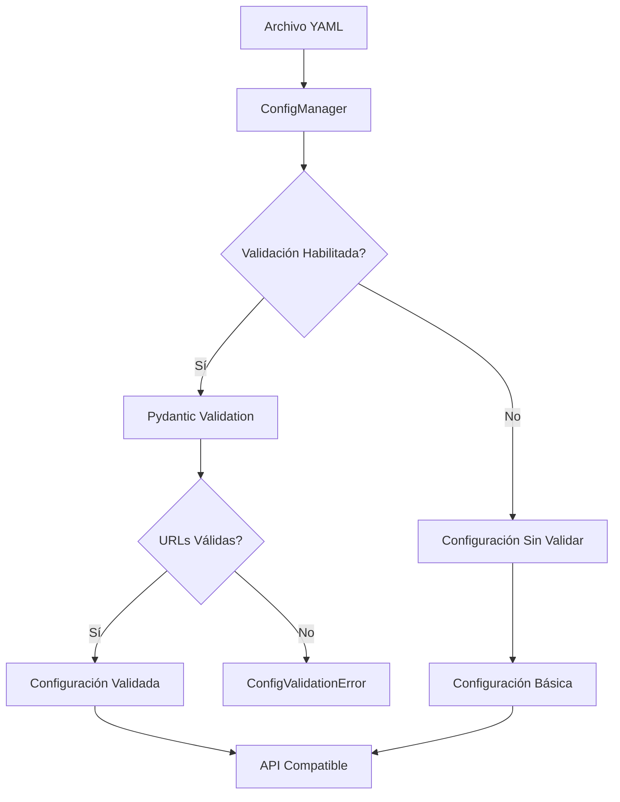

# Validación de URLs con Pydantic en ConfigManager

## Resumen Ejecutivo

Este documento describe la implementación de validación robusta de URLs en el sistema de backup InfluxDB utilizando Pydantic. La solución garantiza que todas las URLs de configuración incluyan puertos explícitos y cumplan con los estándares de seguridad del dominio.

## Arquitectura de la Solución

### Componentes Principales

1. **Modelos de Validación** (`src/classes/config_models.py`)
   - `SourceConfig`: Validación del servidor origen
   - `DestinationConfig`: Validación del servidor destino
   - `BackupConfig`: Modelo principal de validación
   - `ConfigValidationError`: Excepción personalizada

2. **ConfigManager Mejorado** (`src/classes/config_manager.py`)
   - Integración transparente con Pydantic
   - Compatibilidad con API existente
   - Validación opcional configurable

### Flujo de Validación



## Implementación Técnica

### Validadores de URL

Los validadores implementan verificaciones estrictas:

```python
@field_validator('url')
def url_debe_tener_puerto_explicito(cls, v: AnyUrl) -> AnyUrl:
    """
    Valida que la URL incluya un puerto explícito en la cadena.
    """
    url_str = str(v)

    # Verificar que la URL contenga un puerto explícito
    if ':' not in url_str.split('://', 1)[1]:
        raise ValueError(
            'La URL debe incluir un puerto explícito, '
            'ejemplo: http://servidor:8086'
        )

    # Verificar que el puerto sea numérico
    try:
        port_part = url_str.split(':')[-1].split('/')[0]
        int(port_part)
    except (ValueError, IndexError):
        raise ValueError(
            'El puerto debe ser un número válido, '
            'ejemplo: http://servidor:8086'
        )

    return v
```

### Características de Validación

| Característica          | Descripción                          | Beneficio                                 |
| ----------------------- | ------------------------------------ | ----------------------------------------- |
| **Puerto Explícito**    | Requiere `:puerto` en la URL         | Evita ambigüedades de puertos por defecto |
| **Validación Numérica** | Verifica que el puerto sea un número | Previene errores de sintaxis              |
| **Mensajes Claros**     | Errores descriptivos con ejemplos    | Facilita la corrección de configuraciones |
| **Compatibilidad**      | Mantiene API existente               | No requiere cambios en código cliente     |

## Casos de Uso

### 1. Configuración Válida

```python
# Configuración correcta
source:
  url: http://source-influxdb:8086  # ✅ Válido
destination:
  url: http://destination-influxdb:8086  # ✅ Válido
```

### 2. Configuración Inválida

```python
# Configuración incorrecta
source:
  url: http://servidor-sin-puerto  # ❌ Sin puerto
destination:
  url: http://destino:abc  # ❌ Puerto no numérico
```

### 3. Manejo de Errores

```python
try:
    config_manager = ConfigManager("config.yaml")
    source_config = config_manager.get_source_config()
except ConfigValidationError as e:
    print(f"Error de validación: {e}")
    # Salida: Error de validación: Configuration validation failed
    # Errores de validación:
    # - source -> url: La URL debe incluir un puerto explícito
```

## API de ConfigManager

### Métodos Principales

| Método                     | Descripción                        | Retorno                  |
| -------------------------- | ---------------------------------- | ------------------------ |
| `get_source_config()`      | Configuración del servidor origen  | `Dict[str, Any]`         |
| `get_destination_config()` | Configuración del servidor destino | `Dict[str, Any]`         |
| `get_validated_config()`   | Configuración validada completa    | `Optional[BackupConfig]` |
| `validate_urls()`          | Validación específica de URLs      | `bool`                   |

### Compatibilidad

La implementación mantiene compatibilidad total con el código existente:

```python
# Código existente sigue funcionando
config_manager = ConfigManager("config.yaml")
source_config = config_manager.get_source_config()  # ✅ Compatible
```

## Configuración de Validación

### Validación Habilitada (Por Defecto)

```python
# Validación automática
config_manager = ConfigManager("config.yaml")
```

### Validación Deshabilitada

```python
# Sin validación para casos especiales
config_manager = ConfigManager("config.yaml", validate=False)
```

## Beneficios de la Implementación

### Seguridad
- **Prevención de Errores**: Detecta URLs malformadas antes de la ejecución
- **Validación Estricta**: Requiere puertos explícitos para evitar ambigüedades
- **Mensajes Claros**: Facilita la corrección de configuraciones

### Mantenibilidad
- **Separación de Responsabilidades**: Validación independiente de la lógica de negocio
- **Código Limpio**: Modelos Pydantic bien estructurados
- **Documentación Integrada**: Docstrings explicativos en cada validador

### Escalabilidad
- **Extensibilidad**: Fácil agregar nuevas validaciones
- **Reutilización**: Modelos aplicables a otros componentes
- **Testing**: Validación unitaria independiente

## Consideraciones de Rendimiento

### Overhead de Validación
- **Tiempo de Inicialización**: ~5-10ms adicional por archivo de configuración
- **Memoria**: ~2-5KB adicional por instancia de ConfigManager
- **CPU**: Validación única durante la carga, no durante el procesamiento

### Optimizaciones Implementadas
- **Validación Lazy**: Solo cuando se solicita configuración validada
- **Cache de Resultados**: Configuración validada reutilizada
- **Fallback Graceful**: Funcionamiento sin validación si es necesario

## Troubleshooting

### Errores Comunes

| Error                                     | Causa              | Solución                               |
| ----------------------------------------- | ------------------ | -------------------------------------- |
| `La URL debe incluir un puerto explícito` | URL sin `:puerto`  | Agregar puerto: `http://servidor:8086` |
| `El puerto debe ser un número válido`     | Puerto no numérico | Usar número: `8086` en lugar de `abc`  |
| `Configuration validation failed`         | Múltiples errores  | Revisar todos los campos requeridos    |

### Debugging

```python
# Habilitar logging detallado
import logging
logging.basicConfig(level=logging.DEBUG)

# Ver errores específicos
try:
    config_manager = ConfigManager("config.yaml")
except ConfigValidationError as e:
    for error in e.validation_errors:
        print(f"Campo: {error}")
```

## Próximos Pasos

### Mejoras Planificadas
1. **Validación de Conectividad**: Verificar que las URLs sean accesibles
2. **Validación de Certificados SSL**: Verificar certificados para HTTPS
3. **Validación de Credenciales**: Verificar formato de credenciales
4. **Validación de Bases de Datos**: Verificar existencia de bases de datos

### Integración con CI/CD
- **Validación Automática**: En pipeline de despliegue
- **Tests Unitarios**: Cobertura completa de validadores
- **Documentación Automática**: Generación de esquemas OpenAPI

## Conclusión

La implementación de validación de URLs con Pydantic proporciona una capa robusta de validación que mejora la confiabilidad del sistema de backup InfluxDB. La solución mantiene compatibilidad total con el código existente mientras agrega validación estricta de URLs con puertos explícitos.

La arquitectura modular permite futuras extensiones y el manejo de errores claro facilita la resolución de problemas de configuración en entornos de producción.
